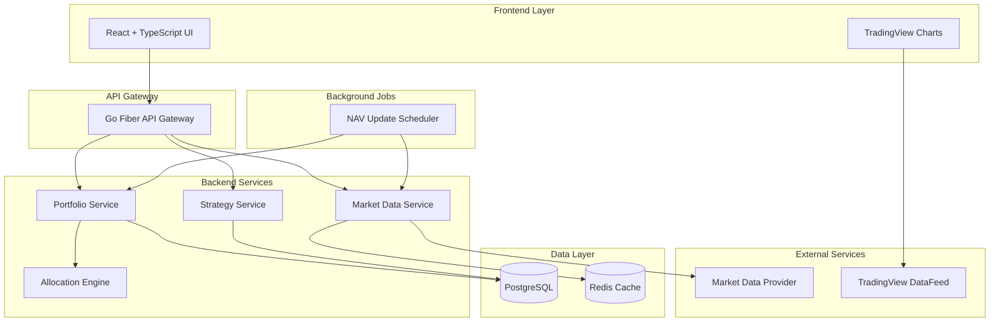

# Design Document

## Overview

The Integrated Portfolio Web App follows a microservices architecture with a React frontend, Go backend API, PostgreSQL database, and Redis cache. The system is designed for real-time portfolio management with dynamic allocation calculations, market data integration, and performance tracking.

## Architecture

### System Architecture



### Technology Stack

- **Frontend**: React 18 + TypeScript, Tailwind CSS, shadcn/ui components
- **Backend**: Go with Fiber framework for high-performance HTTP handling
- **Database**: PostgreSQL 15 for ACID compliance and complex queries
- **Cache**: Redis 7 for market data caching and session management
- **Containerization**: Docker with multi-stage builds, Docker Compose for development
- **Background Processing**: Go routines with cron scheduling for NAV updates

## Components and Interfaces

### Frontend Components

#### Strategy Designer Component
```typescript
interface StrategyDesignerProps {
  strategies: Strategy[]
  stocks: Stock[]
  onStrategyCreate: (strategy: CreateStrategyRequest) => Promise<void>
  onStrategyUpdate: (id: string, updates: UpdateStrategyRequest) => Promise<void>
  onStockToggle: (strategyId: string, stockId: string, eligible: boolean) => Promise<void>
}
```

#### Portfolio Builder Component
```typescript
interface PortfolioBuilderProps {
  strategies: Strategy[]
  totalInvestment: number
  onInvestmentChange: (amount: number) => void
  onPreviewGenerate: () => Promise<AllocationPreview>
  onPortfolioCreate: (request: CreatePortfolioRequest) => Promise<Portfolio>
}
```

#### TradingView Chart Component
```typescript
interface TradingViewChartProps {
  symbol: string
  interval: string
  theme: 'light' | 'dark'
  height: number
  datafeedUrl: string
}
```

### Backend Service Interfaces

#### Strategy Service
```go
type StrategyService interface {
    CreateStrategy(ctx context.Context, req CreateStrategyRequest) (*Strategy, error)
    UpdateStrategy(ctx context.Context, id string, req UpdateStrategyRequest) (*Strategy, error)
    GetUserStrategies(ctx context.Context, userID string) ([]*Strategy, error)
    UpdateStockEligibility(ctx context.Context, strategyID, stockID string, eligible bool) error
}
```

#### Portfolio Service
```go
type PortfolioService interface {
    GenerateAllocationPreview(ctx context.Context, req AllocationRequest) (*AllocationPreview, error)
    CreatePortfolio(ctx context.Context, req CreatePortfolioRequest) (*Portfolio, error)
    GetPortfolio(ctx context.Context, id string) (*Portfolio, error)
    GetPortfolioHistory(ctx context.Context, id string, from, to time.Time) ([]*NAVHistory, error)
    UpdatePortfolioNAV(ctx context.Context, id string) error
}
```

#### Market Data Service
```go
type MarketDataService interface {
    GetQuote(ctx context.Context, symbol string) (*Quote, error)
    GetOHLCV(ctx context.Context, symbol string, from, to time.Time, interval string) ([]*OHLCV, error)
    GetMultipleQuotes(ctx context.Context, symbols []string) (map[string]*Quote, error)
}
```

### Allocation Engine

#### Core Algorithm
```go
type AllocationEngine struct {
    constraints ConstraintValidator
    calculator  AllocationCalculator
}

func (e *AllocationEngine) CalculateAllocations(
    strategies []*Strategy,
    totalInvestment decimal.Decimal,
    constraints *AllocationConstraints,
) (*AllocationResult, error) {
    // 1. Calculate per-strategy weights
    strategyAllocations := e.calculateStrategyWeights(strategies, totalInvestment)
    
    // 2. Distribute within strategies to eligible "Buy" stocks
    stockAllocations := e.distributeToStocks(strategies, strategyAllocations)
    
    // 3. Apply constraints (min/max allocations)
    constrainedAllocations := e.applyConstraints(stockAllocations, constraints)
    
    // 4. Normalize to match total investment
    finalAllocations := e.normalize(constrainedAllocations, totalInvestment)
    
    return &AllocationResult{
        Allocations: finalAllocations,
        UnallocatedCash: e.calculateUnallocatedCash(finalAllocations, totalInvestment),
    }, nil
}
```

## Data Models

### Core Entities

```sql
-- Users table
CREATE TABLE users (
    id UUID PRIMARY KEY DEFAULT gen_random_uuid(),
    name VARCHAR(255) NOT NULL,
    email VARCHAR(255) UNIQUE NOT NULL,
    created_at TIMESTAMP DEFAULT NOW(),
    updated_at TIMESTAMP DEFAULT NOW()
);

-- Strategies table
CREATE TABLE strategies (
    id UUID PRIMARY KEY DEFAULT gen_random_uuid(),
    user_id UUID NOT NULL REFERENCES users(id) ON DELETE CASCADE,
    name VARCHAR(255) NOT NULL,
    weight_mode VARCHAR(20) NOT NULL CHECK (weight_mode IN ('percent', 'budget')),
    weight_value DECIMAL(15,2) NOT NULL,
    created_at TIMESTAMP DEFAULT NOW(),
    updated_at TIMESTAMP DEFAULT NOW()
);

-- Stocks table
CREATE TABLE stocks (
    id UUID PRIMARY KEY DEFAULT gen_random_uuid(),
    ticker VARCHAR(20) UNIQUE NOT NULL,
    name VARCHAR(255) NOT NULL,
    sector VARCHAR(100),
    created_at TIMESTAMP DEFAULT NOW()
);

-- Strategy-Stock relationships
CREATE TABLE strategy_stocks (
    strategy_id UUID NOT NULL REFERENCES strategies(id) ON DELETE CASCADE,
    stock_id UUID NOT NULL REFERENCES stocks(id) ON DELETE CASCADE,
    eligible BOOLEAN NOT NULL DEFAULT true,
    created_at TIMESTAMP DEFAULT NOW(),
    PRIMARY KEY (strategy_id, stock_id)
);

-- Stock signals
CREATE TABLE signals (
    stock_id UUID NOT NULL REFERENCES stocks(id) ON DELETE CASCADE,
    signal VARCHAR(10) NOT NULL CHECK (signal IN ('Buy', 'Hold')),
    date DATE NOT NULL,
    created_at TIMESTAMP DEFAULT NOW(),
    PRIMARY KEY (stock_id, date)
);

-- Portfolios table
CREATE TABLE portfolios (
    id UUID PRIMARY KEY DEFAULT gen_random_uuid(),
    user_id UUID NOT NULL REFERENCES users(id) ON DELETE CASCADE,
    name VARCHAR(255) NOT NULL,
    total_investment DECIMAL(15,2) NOT NULL,
    created_at TIMESTAMP DEFAULT NOW()
);

-- Portfolio positions
CREATE TABLE positions (
    portfolio_id UUID NOT NULL REFERENCES portfolios(id) ON DELETE CASCADE,
    stock_id UUID NOT NULL REFERENCES stocks(id),
    quantity INTEGER NOT NULL,
    entry_price DECIMAL(10,4) NOT NULL,
    allocation_value DECIMAL(15,2) NOT NULL,
    strategy_contrib JSONB, -- JSON object mapping strategy_id to contribution amount
    created_at TIMESTAMP DEFAULT NOW(),
    PRIMARY KEY (portfolio_id, stock_id)
);

-- NAV history for performance tracking
CREATE TABLE nav_history (
    portfolio_id UUID NOT NULL REFERENCES portfolios(id) ON DELETE CASCADE,
    timestamp TIMESTAMP NOT NULL,
    nav DECIMAL(15,2) NOT NULL,
    pnl DECIMAL(15,2) NOT NULL,
    drawdown DECIMAL(8,4), -- Percentage drawdown from peak
    created_at TIMESTAMP DEFAULT NOW(),
    PRIMARY KEY (portfolio_id, timestamp)
);
```

### Indexes for Performance
```sql
CREATE INDEX idx_strategies_user_id ON strategies(user_id);
CREATE INDEX idx_strategy_stocks_strategy_id ON strategy_stocks(strategy_id);
CREATE INDEX idx_signals_stock_date ON signals(stock_id, date DESC);
CREATE INDEX idx_portfolios_user_id ON portfolios(user_id);
CREATE INDEX idx_positions_portfolio_id ON positions(portfolio_id);
CREATE INDEX idx_nav_history_portfolio_timestamp ON nav_history(portfolio_id, timestamp DESC);
```

## Error Handling

### Error Types and Responses

```go
type ErrorType string

const (
    ValidationError     ErrorType = "VALIDATION_ERROR"
    NotFoundError      ErrorType = "NOT_FOUND"
    ConflictError      ErrorType = "CONFLICT"
    ExternalAPIError   ErrorType = "EXTERNAL_API_ERROR"
    InternalError      ErrorType = "INTERNAL_ERROR"
)

type APIError struct {
    Type    ErrorType `json:"type"`
    Message string    `json:"message"`
    Details map[string]interface{} `json:"details,omitempty"`
}
```

### Error Handling Strategy

1. **Validation Errors**: Return 400 with detailed field-level validation messages
2. **Market Data Failures**: Graceful degradation with cached data and staleness indicators
3. **Allocation Constraint Violations**: Return 422 with suggested constraint adjustments
4. **Database Errors**: Log internally, return generic 500 to users
5. **External API Timeouts**: Implement circuit breaker pattern with fallback responses

### Circuit Breaker Implementation
```go
type CircuitBreaker struct {
    maxFailures int
    timeout     time.Duration
    state       CircuitState
    failures    int
    lastFailure time.Time
}

func (cb *CircuitBreaker) Call(fn func() error) error {
    if cb.state == Open && time.Since(cb.lastFailure) < cb.timeout {
        return ErrCircuitOpen
    }
    
    err := fn()
    if err != nil {
        cb.recordFailure()
        return err
    }
    
    cb.recordSuccess()
    return nil
}
```

## Testing Strategy

### Unit Testing
- **Coverage Target**: 85% code coverage for business logic
- **Go Testing**: Use testify for assertions and mocking
- **React Testing**: Jest + React Testing Library for component testing
- **Database Testing**: Use testcontainers for integration tests with real PostgreSQL

### Integration Testing
- **API Testing**: Automated tests for all REST endpoints
- **Database Integration**: Test complex queries and transaction handling
- **Market Data Integration**: Mock external APIs with realistic response patterns
- **End-to-End Allocation Testing**: Verify allocation calculations across multiple scenarios

### Performance Testing
- **Load Testing**: Support 100 concurrent users with <200ms response times
- **Database Performance**: Query optimization for portfolio calculations
- **Memory Usage**: Monitor Go garbage collection and React component re-renders
- **Market Data Caching**: Test Redis performance under high read loads

### Test Data Management
```go
type TestDataBuilder struct {
    db *sql.DB
}

func (b *TestDataBuilder) CreateTestPortfolio() *Portfolio {
    user := b.CreateUser("test@example.com")
    strategy := b.CreateStrategy(user.ID, "Growth", "percent", 100.0)
    stocks := b.CreateStocks([]string{"AAPL", "GOOGL", "MSFT"})
    b.AssignStocksToStrategy(strategy.ID, stocks)
    return b.CreatePortfolio(user.ID, "Test Portfolio", 10000.0)
}
```

### Continuous Integration
- **GitHub Actions**: Automated testing on pull requests
- **Docker Testing**: Build and test containerized application
- **Database Migrations**: Test schema changes in CI environment
- **Security Scanning**: Automated vulnerability scanning for dependencies