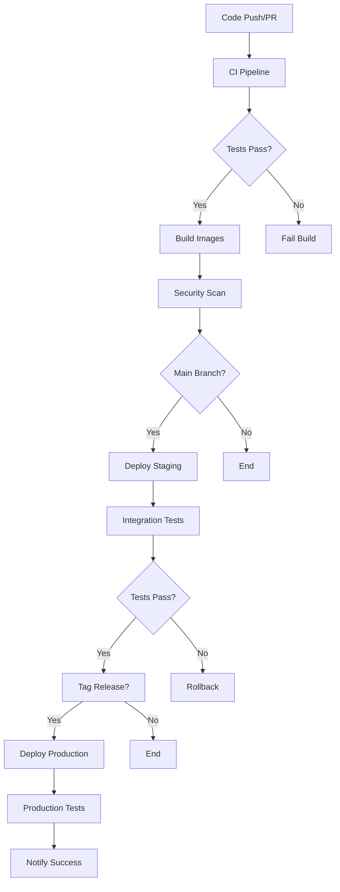

# CI/CD Pipeline Documentation

This document describes the Continuous Integration and Continuous Deployment pipeline for the Portfolio Web App.

## Overview

The CI/CD pipeline is built using GitHub Actions and consists of multiple workflows:

- **CI Pipeline** (`ci.yml`): Automated testing, linting, and security scanning
- **CD Pipeline** (`cd.yml`): Automated deployment to staging and production
- **Security Scan** (`security.yml`): Regular security vulnerability scanning
- **Backup** (`backup.yml`): Automated database backups

## Pipeline Architecture



## Workflows

### 1. CI Pipeline (ci.yml)

**Triggers:**
- Push to `main` or `develop` branches
- Pull requests to `main` or `develop` branches

**Jobs:**
- **backend-test**: Go testing, linting, and formatting checks
- **frontend-test**: Node.js testing, linting, and TypeScript checks
- **security-scan**: Vulnerability scanning with Trivy and Snyk
- **docker-build**: Docker image build testing
- **integration-test**: End-to-end integration testing

**Key Features:**
- Parallel execution for faster feedback
- Comprehensive test coverage reporting
- Security vulnerability scanning
- Docker image build verification
- Integration testing with real services

### 2. CD Pipeline (cd.yml)

**Triggers:**
- Push to `main` branch (staging deployment)
- Git tags starting with `v*` (production deployment)
- Manual workflow dispatch

**Jobs:**
- **build-and-push**: Build and push Docker images to GitHub Container Registry
- **deploy-staging**: Deploy to staging environment
- **deploy-production**: Deploy to production environment (requires staging success)
- **migrate-database**: Run database migrations

**Key Features:**
- Multi-platform Docker builds (AMD64, ARM64)
- Zero-downtime deployments
- Automatic database migrations
- Health checks and smoke tests
- Rollback capabilities

### 3. Security Pipeline (security.yml)

**Triggers:**
- Weekly schedule (Monday 2 AM)
- Push to `main` branch
- Pull requests to `main` branch

**Jobs:**
- **dependency-scan**: Scan Go and Node.js dependencies
- **container-scan**: Scan Docker images for vulnerabilities
- **secret-scan**: Scan for exposed secrets and credentials
- **code-quality**: Static code analysis with SonarCloud and CodeQL

### 4. Backup Pipeline (backup.yml)

**Triggers:**
- Daily schedule (3 AM)
- Manual workflow dispatch

**Jobs:**
- **backup**: Create database backups for staging and production
- Upload backups to cloud storage
- Verify backup integrity
- Clean up old backups

## Environment Configuration

### Required Secrets

#### Staging Environment
```
STAGING_HOST=staging.your-domain.com
STAGING_USER=deploy
STAGING_SSH_KEY=<private-ssh-key>
STAGING_PORT=22
STAGING_DB_PASSWORD=<secure-password>
STAGING_REDIS_PASSWORD=<secure-password>
STAGING_JWT_SECRET=<secure-jwt-secret>
```

#### Production Environment
```
PROD_HOST=your-domain.com
PROD_USER=deploy
PROD_SSH_KEY=<private-ssh-key>
PROD_PORT=22
PROD_DB_PASSWORD=<secure-password>
PROD_REDIS_PASSWORD=<secure-password>
PROD_JWT_SECRET=<secure-jwt-secret>
```

#### External Services
```
MARKET_DATA_API_KEY=<api-key>
SNYK_TOKEN=<snyk-token>
SONAR_TOKEN=<sonar-token>
SLACK_WEBHOOK=<slack-webhook-url>
AWS_ACCESS_KEY_ID=<aws-key>
AWS_SECRET_ACCESS_KEY=<aws-secret>
AWS_DEFAULT_REGION=us-east-1
BACKUP_BUCKET=portfolio-backups
GRAFANA_PASSWORD=<grafana-password>
```

### Environment Setup

1. **Server Preparation:**
   ```bash
   # Install Docker and Docker Compose
   curl -fsSL https://get.docker.com -o get-docker.sh
   sh get-docker.sh
   
   # Create application directory
   sudo mkdir -p /opt/portfolio-app
   sudo chown deploy:deploy /opt/portfolio-app
   
   # Clone repository
   cd /opt/portfolio-app
   git clone <repository-url> .
   ```

2. **SSH Key Setup:**
   ```bash
   # Generate SSH key pair
   ssh-keygen -t ed25519 -C "deploy@portfolio-app"
   
   # Add public key to server
   ssh-copy-id -i ~/.ssh/id_ed25519.pub deploy@server
   
   # Add private key to GitHub Secrets
   cat ~/.ssh/id_ed25519  # Copy to STAGING_SSH_KEY/PROD_SSH_KEY
   ```

## Deployment Process

### Staging Deployment

1. **Automatic Trigger:** Push to `main` branch
2. **Build:** Create Docker images with latest code
3. **Deploy:** Update staging environment
4. **Test:** Run integration and smoke tests
5. **Notify:** Send deployment status to Slack

### Production Deployment

1. **Manual Trigger:** Create git tag (e.g., `v1.0.0`)
2. **Prerequisites:** Staging deployment must be successful
3. **Backup:** Create database backup before deployment
4. **Deploy:** Update production environment with zero downtime
5. **Verify:** Run comprehensive smoke tests
6. **Monitor:** Check application health and metrics

### Rollback Process

```bash
# Automatic rollback on health check failure
# Manual rollback process:

# 1. SSH to production server
ssh deploy@your-domain.com

# 2. Navigate to application directory
cd /opt/portfolio-app

# 3. Checkout previous version
git checkout v1.0.0  # Previous working version

# 4. Restore database if needed
./scripts/restore-backup.sh backup-20231201.sql

# 5. Redeploy
./scripts/deploy-prod.sh
```

## Monitoring and Alerting

### Health Checks

- **Application Health:** `/health` endpoint
- **API Health:** `/api/health` endpoint
- **Database Health:** Connection and query tests
- **Redis Health:** Ping tests

### Metrics Collection

- **Prometheus:** Application and infrastructure metrics
- **Grafana:** Visualization and dashboards
- **Docker Stats:** Container resource usage
- **Application Logs:** Centralized logging

### Alerting Rules

```yaml
# Example Prometheus alerting rules
groups:
- name: portfolio-app
  rules:
  - alert: HighErrorRate
    expr: rate(http_requests_total{status=~"5.."}[5m]) > 0.1
    for: 5m
    annotations:
      summary: High error rate detected
      
  - alert: DatabaseDown
    expr: up{job="postgres"} == 0
    for: 1m
    annotations:
      summary: Database is down
```

## Security Considerations

### Image Security
- Multi-stage builds to minimize attack surface
- Non-root users in all containers
- Regular base image updates via Dependabot
- Vulnerability scanning with Trivy

### Secret Management
- Environment variables for configuration
- GitHub Secrets for sensitive data
- No secrets in code or Docker images
- Regular secret rotation

### Network Security
- Internal Docker networks
- Reverse proxy with rate limiting
- SSL/TLS encryption
- CORS protection

### Access Control
- SSH key-based authentication
- Principle of least privilege
- Regular access reviews
- Audit logging

## Troubleshooting

### Common Issues

1. **Build Failures:**
   ```bash
   # Check build logs
   gh run view <run-id>
   
   # Local testing
   docker build -t test ./backend
   docker build -t test ./frontend
   ```

2. **Deployment Failures:**
   ```bash
   # Check deployment logs
   ssh deploy@server
   cd /opt/portfolio-app
   docker-compose -f docker-compose.prod.yml logs
   ```

3. **Test Failures:**
   ```bash
   # Run tests locally
   cd backend && go test ./...
   cd frontend && npm test
   ```

### Debug Commands

```bash
# Check service status
docker-compose -f docker-compose.prod.yml ps

# View logs
docker-compose -f docker-compose.prod.yml logs -f

# Execute commands in containers
docker-compose -f docker-compose.prod.yml exec backend ./main health
docker-compose -f docker-compose.prod.yml exec postgres psql -U $DB_USER $DB_NAME

# Check resource usage
docker stats

# Network debugging
docker network ls
docker network inspect portfolio-manager_backend-network
```

## Performance Optimization

### Build Optimization
- Docker layer caching
- Multi-stage builds
- Parallel job execution
- Dependency caching

### Deployment Optimization
- Blue-green deployments
- Rolling updates
- Health check optimization
- Resource limits and requests

### Testing Optimization
- Test parallelization
- Selective test execution
- Test result caching
- Fast feedback loops

## Maintenance

### Regular Tasks

1. **Weekly:**
   - Review failed builds and deployments
   - Update dependencies via Dependabot PRs
   - Check security scan results

2. **Monthly:**
   - Review and update CI/CD pipeline
   - Analyze build and deployment metrics
   - Update documentation

3. **Quarterly:**
   - Security audit of CI/CD pipeline
   - Performance optimization review
   - Disaster recovery testing

### Pipeline Updates

```bash
# Test pipeline changes locally
act -j ci  # Using act to run GitHub Actions locally

# Validate workflow syntax
gh workflow view ci.yml

# Monitor pipeline performance
gh run list --limit 50
```